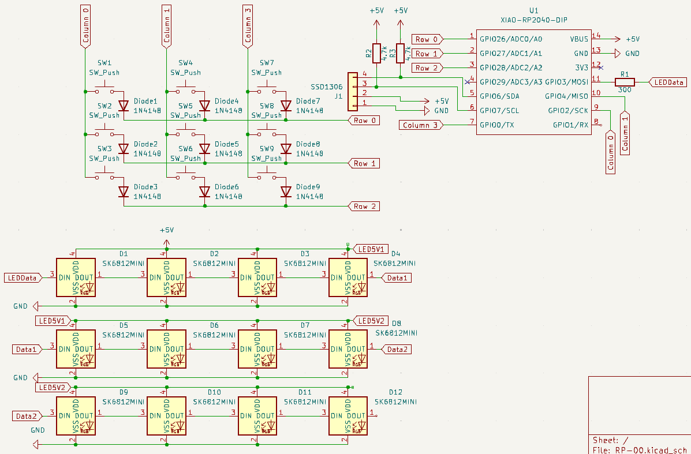
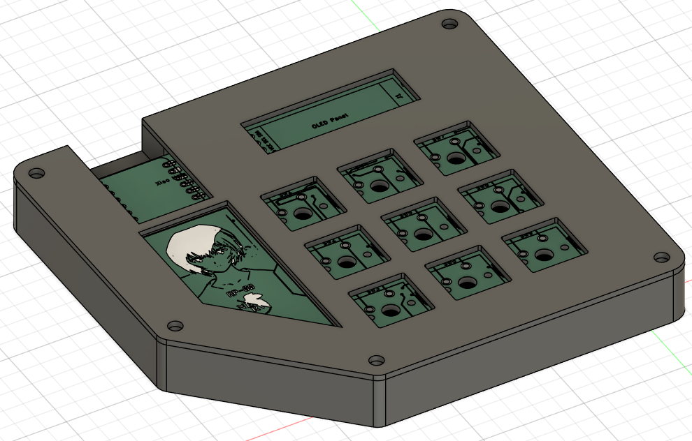

# RP-00
A custom macropad with a 3x3 matrix of switches, a 0.91" I2C OLED display, and 12 SK6182 LEDs all powered by a Seeed XIAO RP2040 DIP.

This project was designed and modeled entirely for the Hack Club Blueprint program.

## Features
```
Quick Phrase - Types "I hate kittens."
Save - Sends CTRL + S
LEDTOG - Turns LEDs on or off

Quick Email - Types your email
Copy - Sends CTRL + C
Paste - Sends CTRL + V

Num7 - Sends Num7
Cut - Sends CTRL + X
Num9 - Sends Num9
```

## Planned Features:
```
Interface with OLED Support
Options to create macros without having to code
WLED-like LED settings and animations
Clipboard Indicator
Icons & Animations
```

## System Layout
```
Switches:
Row 0 - GPIO26
Row 1 - GPIO27
Row 2 - GPIO28
Column 0 - GPIO2
Column 1 - GPIO4
Column 3 (woops i should fix that) - GPIO00

OLED
Pin 1 - GND
Pin 2 - 5V
Pin 3 - SCL (GPIO7)
Pin 4 - SDA (GPIO6)

RGBW LEDs (SK6812)
GPIO3 - LEDData (DIN)
Pin 1 DOUT - Pin 2 DIN
VDD - 5V
VSS - GND
```

## Structure
```
RP-00/
├── CAD/
│   ├── Bottom Case.step
│   ├── Top Case.step
│   └── Assembly.step
├── PCB/
│   ├── RP-00/
│   │   ├── RP-00.kicad_pro
│   │   ├── RP-00.kicad_sch
│   │   └── RP-00.kicad_pcb
│   ├── D+G/
│   │   ├── RP-00-B_Cu.gbr
│   │   ├── RP-00-B_Mask.gbr
│   │   ├── RP-00-B_Paste.gbr
│   │   ├── RP-00-B_Silkscreen.gbr
│   │   ├── RP-00-Edge_Cuts.gbr
│   │   ├── RP-00-F_Cu.gbr
│   │   ├── RP-00-F_Paste.gbr
│   │   ├── RP-00-F_Silkscreen.gbr
│   │   ├── RP-00-job.gbr.job
│   │   ├── RP-00-NPTH.drl
│   │   └── RP-00-PTH.drl
│   └── D+G.zip
├── Firmware/
│   └── main.py
├── Images/
│   ├── Assembly.png
│   ├── Bottom Case.png
│   ├── DRC 1.png
│   ├── DRC 2.png
│   ├── PCB Back.png
│   ├── PCB Front.png
│   ├── PCB Full.png
│   ├── Schematic.png
│   └── Top Case.png
└── README.md
```

## Screenshots





## Credits
Created by me (Miaoumi)

Made with KiCad, Autodesk Fusion

thanks hack club for funding